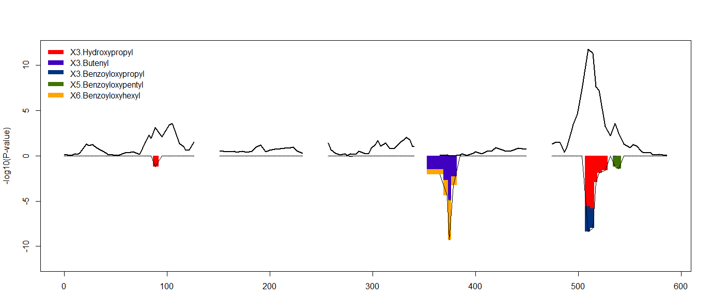

# Summary

CTL mapping (CTL) is a novel method that associates correlation differences observed between phenotypes to genomic loci. 
CTL mapping can be used in the analysis of experimental and outbred crosses, as well as study human populations. CTL 
allows geneticists, biologists and animal breeders to analyze correlation difference between phenotypes. CTL analysis 
can be performed on phenotypes obtained from the whole biomolecular spectrum. From 'classic' phenotypes such as yield 
and disease suscepibility to high-throughput experimental data such as microarrays, RNA-seq and/or protein abundance 
measurements.

The CTL software is provided as a free and open source (FOSS) package for the R Project for Statistical Computing [@R:2005]. The 
core algorithm is written in C allowing it to be deployed anywhere, but it also provides easy integration of the algorithm 
into other languages that allow calling C functions. As a proof of concept we provide bindings for the D 2.0 language. 

Data structures of the CTL mapping package have been harmonized with the popular R/qtl package [@Arends:2010], allowing 
users to quickly and effiently re-analyse previous (R/)QTL experiments. Additional advantages of close integration with 
R/qtl are that CTL users can use any input formats supported by R/qtl, and additionally have access to all plot and 
helper functions provided by R/qtl.

To increase the reach of our method, we have integrated CTL into GeneNetwork (GN) a free and open source (FOSS) 
framework for web-based genetics that can be deployed anywhere [@Sloan:2016]. This allows results from CTL mapping to be 
interactively explored using the familiar GeneNetwork web interface. Additionally results from CTL mapping can be visualized 
by plotting routines provided by the R package, however results can also be exported to external tools (such as 
Cytoscape [@Cytoscape:2003]) for visualization and interactive exploration.

# Example datasets

CTL mapping comes with several example datasets (in Rdata format) for the user to explore:

- 301 gene expression traits measured on 109 Saccharomyces cerevisia [@Brem:2002]
- 9 Metabolite expression traits measured on 403 Arabidopsis Thaliana [@Churchill:2012]
- 24 Metabolite expression traits measured on 162 Arabidopsis Thaliana [@Keurentjes:2002]

-

# Future work

Future work includes research into better handling of RAM by the CTL algorithm. 
The authors also aim to provide additional interactive visualization (such as D3 interactive graphics). 

# References