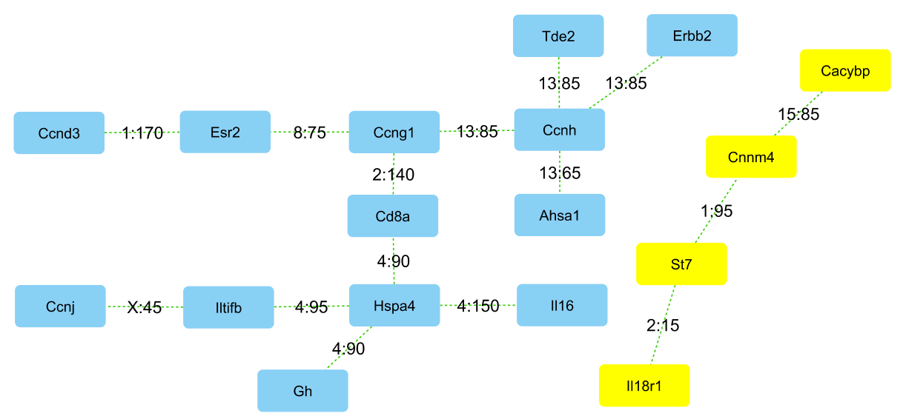

# Summary

The [CTLmapping repository](https://github.com/DannyArends/CTLmapping)
contains an implementation of the Correlation Trait Loci (CTL)
algorithm first presented [@Arends:thesis_chapter].  CTL mapping
allows geneticists to pursue network inference by analysing
correlation difference between phenotypes.

CTL mapping is complementary to the proven quantitative trait locus
(QTL) mapping method which maps/associates observed phenotype differences
against genotype. CTL mapping associates correlation differences
observed *between* phenotypes, subject to the genotype. In other
words, QTL mapping treats phenotypes independently while CTL mapping
connects phenotypes. CTL generally show very similar profiles to QTL,
but get interesting when they differ (see figure 1).

By comparing differences between QTL and CTL and by connecting
phenotypes CTL mapping provides a mechanism for inference and
discovery of causality (see chapter 4 [@Arends:thesis_chapter]).  This
is particularly of interest when phenotype correlations change with
conditions, for example in pathways with highly correlated gene
expression patterns (see figure 1).  CTL mapping differs from existing
correlation methods, such as set test methods (e.g., [@Wang:2010]) in
that CTL mapping does not require prior information on sets (e.g.,
pathways) and uses (existing) QTL information for inference.

- Figure 1: Examples of colocated CTL and
QTL profiles, as found in [GeneNetwork](http://genenetwork.org/)
dataset GN207 (BXD mouse eye mRNA). (a) CTL without a colocalizing QTL
between the expression *St7* and *Il18r1* genes, i.e., CTL changes at
~ 15 Mb at chromosome 2 from -0.39 B locus, to 0.86 D locus while both
genes do not show a difference in mean expression. (b) *St7* gene
shows a QTL at chromosome 6 and no CTL are detected between *St7* and
*Il18r1* (possibly implying that the expression of this gene is
regulated by some variant at this locus). (c) *Mtvr2* gene shows a CTL
and QTL at chromosome 19. A significant change in correlation with the
*C1qtnf5* gene is observed (0.85 B locus to -0.46 D locus), leading to
a very similar CTL profile.

CTL analysis can be performed on combined phenotypes obtained from the
whole spectrum of data types: i.e., from classical phenotypes, such as
yield and disease suscepibility, to high-throughput experimental data,
such as microarrays, RNA-seq and/or protein abundance measurements.
This is especially useful in combined datasets, e.g. a combination of:
classical phenotypes, protein abundance and gene expression (see
figure 2).

- Figure 2: By network inference CTL discover the
genetic wiring of classical phenotypes and identify known and new key
players in the genetic / protein network underlying classical
phenotypes using CTL and QTL information; as discovered without prior
information in GeneNetwork BXD mouse datasets (again from
GN207). Here we visualise significantly changed correlation between
genes in different studies as edges between the genes (nodes) with
links showing the location (Chr:Position) at which correlation was
lost.

CTL mapping can be applied in model organism experimental crosses, such
as mouse and the plant *Arabidopsis thaliana* (see example datasets
below); as well as outbred-crosses, such as the Mouse diversity
outbred cross (Mouse-DO), the Rat heterogeneous stock (Rat HS) and in
A. *thaliana* MAGIC; as well as in natural populations, such as human. For
statistical power, in general: the more individuals the better. But,
as a rule of thumb it is about the same as for QTL, i.e., about 100
individuals for a recombinant inbred line (RIL), and 1,000 individuals
for genome-wide association (GWA) in human [@Arends:thesis_chapter].

The CTL mapping software is provided as a free and open source (FOSS)
package for the R Project for Statistical Computing [@R:2005].
Data structures of the CTL mapping R package have been harmonized with
the popular R/qtl package [@Arends:2010], allowing users to quickly
and efficiently re-analyse previous (R/)QTL experiments. Additional
advantages of close integration with R/qtl are the many input formats
supported by R/qtl, and access to all plot and helper functions
provided by R/qtl.

The core CTL mapping algorithm is written in standalone C making it
easy to integrate the CTL mapping algorithm into other languages that
support bindings to C functions. As a proof of concept the CTL
repository provides bindings for the [D programming language](http://dlang.org/).

CTL has been integrated into
[GeneNetwork (GN)](http://genenetwork.org/), a FOSS framework for
web-based genetics that can be deployed anywhere [@Sloan:2016]. This
allows results from CTL mapping to be interactively explored using the
GeneNetwork web interface. Additionally results from CTL mapping can
be visualized by plotting routines provided by the R package and
results can be exported to external tools (such as Cytoscape
[@Cytoscape:2003]) for visualization and interactive exploration.

# Example datasets

CTL mapping comes with several example datasets (in Rdata format) for
the user to explore:

- 301 gene expression traits measured on 109 *Saccharomyces cerevisia* [@Brem:2002]
- 9 Metabolite expression traits measured on 403 *Arabidopsis Thaliana* [@Churchill:2012]
- 24 Metabolite expression traits measured on 162 *Arabidopsis Thaliana* [@Keurentjes:2002]

(instructions can be found in the [README](https://github.com/DannyArends/CTLmapping)).

# Future work

CTL is computationally very intensive, phenotypes O(n^2), both in
terms of RAM use and CPU.  Future work includes research into
improving the CTL algorithm for large scale correlations and
inference, including the use of GPU/supercomputing.  We are also
working on adding explorative interactive visualization (such as
Cytoscape and D3 interactive graphics).

# References
